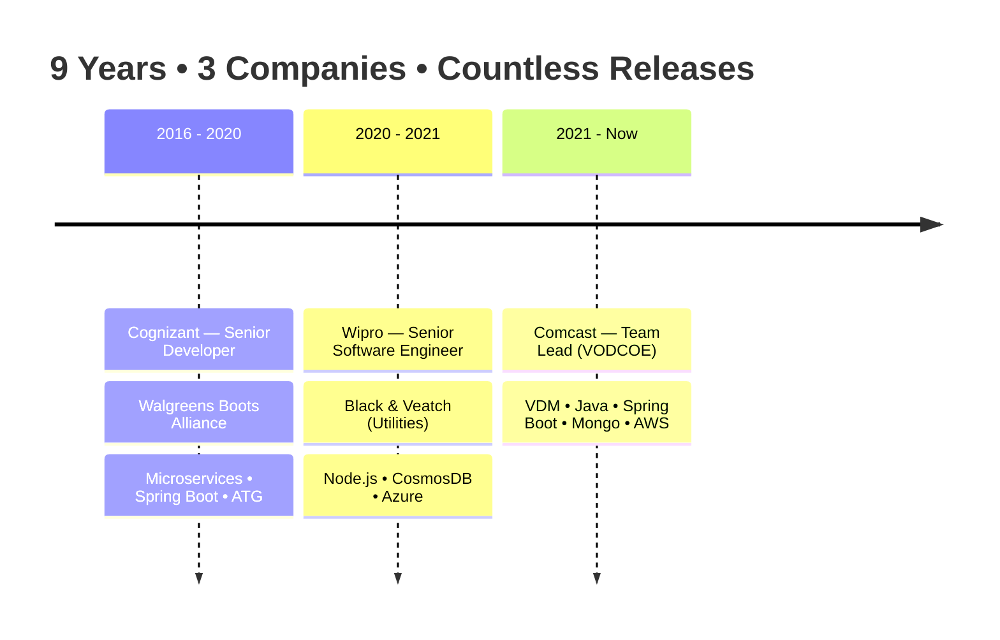

<!-- Banner / Header -->
<div align="center">


<a href="https://git.io/typing-svg">
  
</a>

<p>
  <a href="https://www.linkedin.com/in/joseph-madanu434"></a>
  <a href="mailto:joseph.madanu434@gmail.com"></a>
  <a href="https://github.com/josephzloty"></a>
  
</p>


</div>

---

## <picture></picture> About Me

```yaml
name: Joseph Madanu
role: Senior Java Developer & Team Lead
company: Comcast India Engineering Center
experience: 9+ years
domains: [Media & Video Streaming, Retail & Health Commerce, Utilities]

current_focus:
  - 🚀  Leading the VODCOE team building VDM (VOD Data Mart) at Comcast
  - 🤖  AI Engineering adoption  →  in progress
  - 📜  Spec-Driven Development (SDD) with OpenSpec
  - ☁️   Designing cloud-native microservices on AWS & Azure
  - 🧠  Sharpening system design & distributed systems intuition

what_i_love:
  - Building things that scale to millions of users
  - Mentoring engineers and growing strong teams
  - Clean architecture, clean code, clean specs
  - Gardening 🌱  •  Travelling & Hiking 🏔️  •  Music 🎶
```

---

##  Tech Arsenal

<div align="center">

**Languages**


**Frameworks & Platforms**


**Databases**


**Cloud & DevOps**


**Build • Test • Tools**


**AI / Voice & Emerging**


-FF9800?style=for-the-badge&logo=dialogflow&logoColor=white)


</div>

---

##  Currently Brewing

> The lab is open. Here's what's bubbling 🔬

| 🚀 Initiative | 🎯 Goal | 📈 Status |
|---|---|---|
| **AI Engineering Adoption** | Bring LLM-powered agents, RAG pipelines, and prompt-engineered tooling into enterprise Java workflows | 🟡 In Progress |
| **Spec-Driven Development (SDD)** | Practice **OpenSpec**-first design — write the spec, generate the system | 🟢 Active |
| **VDM @ Comcast** | Scale the VOD Data Mart for millions of streaming events daily | 🟢 Active |
| **Mentorship** | Grow the next layer of engineers on agile, code quality & system design | 🟢 Active |

---

##  Career Snapshot



---

##  GitHub Pulse

<div align="center">


<br />


<br /><br />


<br />


</div>

---

##  Engineering Philosophy

<table>
<tr>
<td width="33%" align="center">
<h3>🧭 Spec First</h3>
<p><i>Great software starts with a great spec. OpenSpec lets the design speak before the code does.</i></p>
</td>
<td width="33%" align="center">
<h3>🤖 AI-Native Mindset</h3>
<p><i>Treat LLMs as a first-class building block — not a gimmick. Adopt thoughtfully, measure rigorously.</i></p>
</td>
<td width="33%" align="center">
<h3>🛡️ Production-Grade</h3>
<p><i>Clean code, instrumented services, and rollbacks that actually work at 3 AM.</i></p>
</td>
</tr>
</table>

---

##  Beyond the Keyboard

🌱  **Gardening** — patience, iteration, and watching things grow (sounds familiar?)
🥾  **Travelling & Hiking** — trails, peaks, and the occasional questionable shortcut
🎶  **Music** — the build soundtrack matters

---

<div align="center">

### Let's build something brilliant together.

<a href="mailto:joseph.madanu434@gmail.com">
  
</a>
<a href="https://www.linkedin.com/in/joseph-madanu434">
  
</a>

<br /><br />


<sub>⭐ Thanks for stopping by — may your builds be green and your queries indexed.</sub>

</div>
